# 🚦 JavaScript Conditional Statements Practice

Welcome to the **JavaScript Conditional Statements Practice** project! 🎉

This project includes **20 beginner-to-advanced level programs** focusing on **decision-making using `if`, `else if`, and `else`** in JavaScript.

All programs use simple `console.log` outputs — no functions, arrays, or objects — just pure logic to strengthen your understanding of conditionals.

---

## 📚 What You'll Learn

- Basics of `if`, `else if`, and `else` chains
- Applying logical thinking to real-world problems
- Writing clean and readable JavaScript code
- Simulating user inputs using variables

---

## 🧩 Project Structure

```
conditional-statements-js/
├── README.md
├── 01-positive-negative-zero.js
├── 02-grade-classification.js
├── ...
├── 20-parking-fee.js
└── screenshots/
    ├── 01-positive-negative-zero.png
    ├── 02-grade-classification.png
    └── ...
```

---

## 🟢 Beginner Level (1–10)

### 1. ✅ Positive, Negative, or Zero
Check whether a number is positive, negative, or zero.
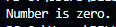

### 2. 🎓 Grade Classification
Assigns grade (A, B, C, Fail) based on score.  
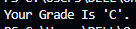

### 3. 📆 Day of the Week (1–7)
Prints day name based on number (1 = Monday, ..., 7 = Sunday).  
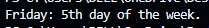

### 4. 🔢 Even or Odd
Checks whether a number is even or odd.  
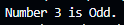

### 5. 🔤 Vowel or Consonant
Checks whether a character is a vowel or consonant.  
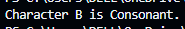

### 6. 🗳️ Voting Eligibility
Checks if age is 18+ for voting.  
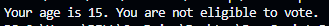

### 7. 🔢 Number Match (1, 2, or 3)
Checks if a number is 1, 2, or 3 using else-if.  
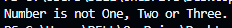

### 8. 🌡️ Temperature Condition
Classifies weather: hot, warm, or cold based on temperature.  
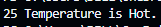

### 9. ⚖️ Compare Two Numbers
Compares two numbers and prints the greater or if equal.  
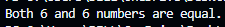

### 10. 🚗 Speed Check
Compares speed against a limit and prints warnings.  


---

## 🟡 Intermediate to Advanced (11–20)

### 11. 🔐 Login Authentication
Simulates user login: admin, user, or guest.  
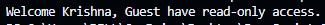

### 12. 📐 Triangle Type by Sides
Checks if a triangle is Equilateral, Isosceles, or Scalene.  
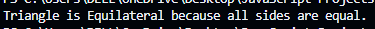

### 13. 🥇 Largest of Three
Finds the largest among three given numbers.  
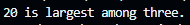

### 14. 📆 Leap Year Checker
Checks if a given year is a leap year.  
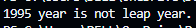

### 15. 📋 Menu-Driven Choice
Implements a menu with basic choices: add, subtract, etc.  
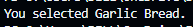

### 16. ⚖️ BMI Classification
Classifies BMI: underweight, normal, overweight, obese.  
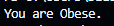

### 17. ⚡ Electricity Bill Slab
Calculates bill based on unit slabs.  
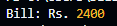

### 18. 🧮 Simple Calculator
Performs add/subtract based on operator.  
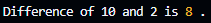

### 19. 👶 Age Group Classification
Categorizes age into child, teen, adult, or senior.  
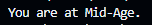

### 20. 🅿️ Parking Fee System
Calculates parking fee based on number of hours.  
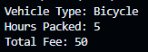

---

## 🚀 How to Run

> No frameworks needed — just plain JavaScript and a console!

1. Open the `.js` file in a text editor or VS Code.
2. Make sure you have [Node.js](https://nodejs.org/) installed.
3. Run the file in the terminal:
   ```bash
   node 01-positive-negative-zero.js
   ```

---

## 🧠 Beginner Tips

- Start slow, one file at a time.
- Modify the inputs and observe output changes.
- Comment each condition to understand the logic better.

---

## 📜 License

Free to use for learning and classroom purposes.

---

## 🎯 Want More?

Let me know if you want this project expanded into:
- A web version with forms & HTML/CSS
- Quiz-style exercises based on these conditionals
- C++ version of all 20 programs

Happy coding! 💻✨