# 🔁 JavaScript Repetitive Logic Programs

Welcome to the **JavaScript Repetitive Logic Practice** project! 🎉

This collection features **26 beginner-friendly JavaScript programs** focused on **loops, summations, number operations, and pattern generation**.

These programs use `for`, `while`, and `do...while` loops, with `console.log` for output — perfect for learning core programming logic.

---

## 📚 What You'll Learn

- Looping techniques (`for`, `while`, `do-while`)
- Summation and arithmetic patterns
- Factorials, digit extraction, and math logic
- Fibonacci and multiplication patterns
- Practice for coding interviews and school projects

---

## 📁 Project Structure

```
repetitive-logic-js/
├── README.md
├── 01-sum-1-to-10.js
├── ...
├── 26-fibonacci-series.js
└── screenshots/
    ├── 01-sum-1-to-10.png
    ├── ...
    └── 26-fibonacci-series.png
```

---

## 🔢 Program List (Description of logic and loop type used.)
### 01. 🔸 Sum of numbers from 1 to 10 (for loop)
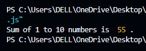

### 02. 🔸 Sum of even numbers from 1 to 20 (for loop)
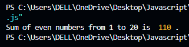

### 03. 🔸 Sum of odd numbers from 1 to 20 (while loop)


### 04. 🔸 Sum of multiples of 5 from 1 to 50 (for loop)
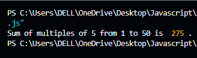

### 05. 🔸 Sum of squares from 1 to 10 (for loop)
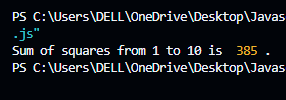

### 06. 🔸 Sum of digits of a number (e.g., 12345)
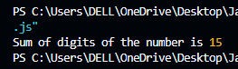

### 07. 🔸 Sum of numbers divisible by both 3 and 7 (1-100)
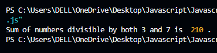

### 08. 🔸 Sum of all prime numbers from 1 to 50
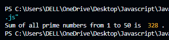

### 09. 🔸 Sum of first 10 natural numbers
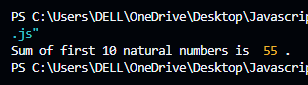

### 10. 🔸 Sum of even numbers between 50 and 100
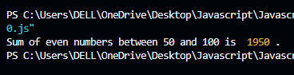

### 11. 🔸 Sum of odd numbers between 100 and 150
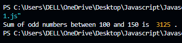

### 12. 🔸 Sum of digits of all numbers from 1 to 50
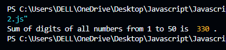

### 13. 🔸 Sum of numbers not divisible by 3 (1–30)
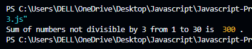

### 14. 🔸 Sum of factorial numbers 1! + 2! + 3! + ... + 5!
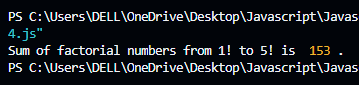

### 15. 🔸 Sum of all numbers ending with digit 7 (1–100)
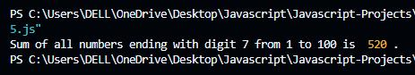

### 16. 🔸 Sum of numbers from 1 to n until sum > 50
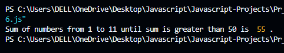

### 17. 🔸 Sum of numbers between 10 and 30 not divisible by 2 or 3
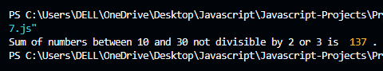

### 18. 🔸 Sum of cubes of 1 to 5
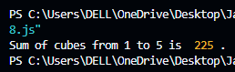

### 19. 🔸 Sum of numbers divisible by 4 but not 8 (1–50)
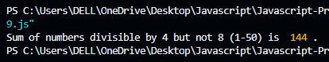

### 20. 🔸 Sum of alternate numbers (1, 3, 5... to 19)
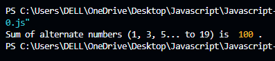

### 21. 🔸 Print 1 to 5 numbers
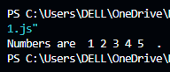

### 22. 🔸 Sum of total numbers from 1 to 20
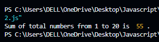

### 23. 🔸 Find the avg of numbers from 1 to 25
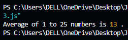

### 24. 🔸 Find the factorial of 1! to 10!
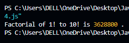

### 25. 🔸 Create a multiplication table of a number
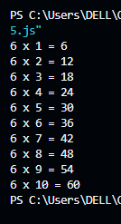

### 26. 🔸 Print Fabonacci Series
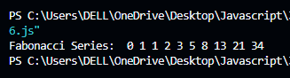


---

## ▶️ How to Run

> You only need Node.js and a terminal!

1. Open the `.js` file in VS Code or any code editor.
2. Run the file using:
   ```bash
   node 01-sum-1-to-10.js
   ```

---

## 🌟 Practice Tips

- Add comments to explain your logic
- Convert `for` loops to `while` to test your understanding
- Try customizing the range and conditions

---

## 📜 License

This project is free for learning and classroom use.

---

Happy coding! 💻✨