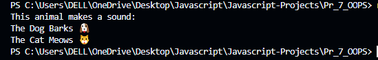
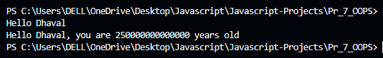
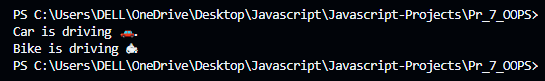
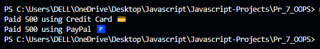
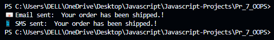
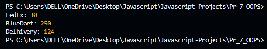
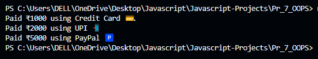
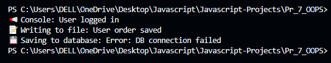
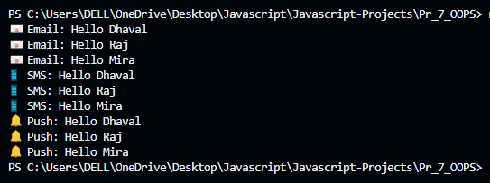
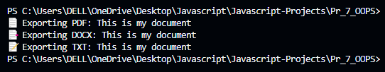

# JavaScript OOP Examples 🚀

This repository contains JavaScript programs that demonstrate **Object-Oriented Programming (OOP) concepts** like **inheritance, polymorphism, abstraction, and method overriding**.  

You can find an overview of each program below. Output screenshots can be added in the **images/** folder.

---

## 📌 Program Overviews

### 1. Animal Sounds (`prog.js`)
Shows how different animals (Dog, Cat) override a base method to make different sounds.  
**Output Screenshot:**  


---

### 2. Greeting Function (`prog1.js`)
Demonstrates function flexibility by greeting with or without an age parameter.  
**Output Screenshot:**  


---

### 3. Vehicle Drive (`prog2.js`)
Illustrates polymorphism by calling the same `drive` method on different vehicle types (Car, Bike).  
**Output Screenshot:**  


---

### 4. Payment System (`prog3.js`)
Represents different payment types (Credit Card, PayPal) that implement the same payment method.  
**Output Screenshot:**  


---

### 5. Notification System (`prog4.js`)
Sends messages through multiple channels like Email and SMS.  
**Output Screenshot:**  


---

### 6. Shipping Providers (`prog5.js`)
Calculates shipping costs using different providers (FedEx, BlueDart, Delhivery).  
**Output Screenshot:**  


---

### 7. Payment Methods (`prog6.js`)
Processes payments using various methods (Credit Card, UPI, PayPal).  
**Output Screenshot:**  


---

### 8. Logger System (`prog7.js`)
Logs messages to different outputs: console, file, or database.  
**Output Screenshot:**  


---

### 9. Multi-Notification (`prog8.js`)
Sends notifications to multiple users via Email, SMS, or Push.  
**Output Screenshot:**  


---

### 10. Document Exporter (`prog9.js`)
Exports content in different formats: PDF, DOCX, or TXT.  
**Output Screenshot:**  


---

## 🛠 How to Run
1. Clone this repository  
   ```bash
   git clone <repo-link>
   ```
2. Run any file using Node.js  
   ```bash
   node prog.js
   ```

## 📷 Screenshots
Add program output images inside the **images/** folder and replace the placeholders above.

---
✨ Author: *Krishna Parmar*