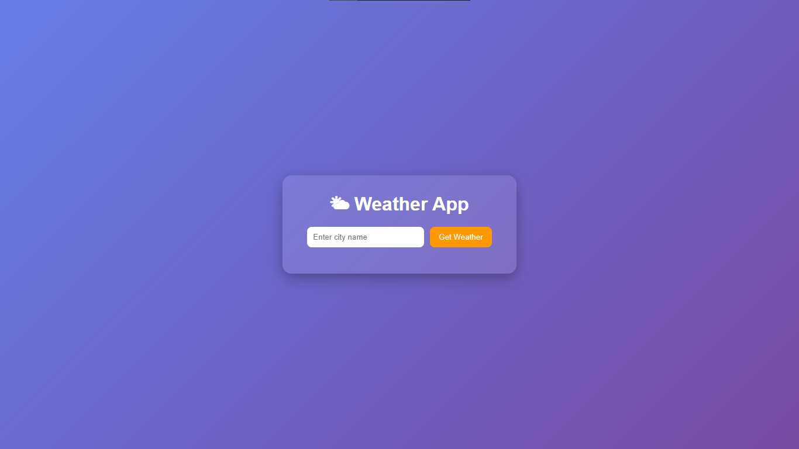

# 🌤 Weather App

An interactive weather application that lets users search for real-time weather information by city name.  
Built using **HTML**, **CSS**, and **JavaScript**, powered by the [OpenWeatherMap API](https://openweathermap.org/).

---

## ✨ Features
- 🔍 Search weather by city name  
- 🌡 Displays temperature, humidity, and wind speed  
- 🌅 Shows sunrise time for the location  
- 🎨 Beautiful UI with gradient background and glassmorphism card  
- 📱 Fully responsive and user-friendly  

---

## 🛠️ Tech Stack
- **Frontend**: HTML5, CSS3, JavaScript (Vanilla JS)  
- **API**: [OpenWeatherMap](https://openweathermap.org/api)  

---

## 🚀 Live Preview
👉 [Click Here to View Live Demo](https://your-live-demo-link.netlify.app/)  

---

## 📸 Output Preview

### Home Screen


---

## ⚙️ How to Run Locally

1. Clone the repository:
   ```bash
   git clone https://github.com/parmarkrishnaa/weather-app.git
   ```

2. Navigate to project folder:
   ```bash
   cd weather-app
   ```

3. Open `index.html` in your browser.

---

## 🔑 API Key Setup
This project uses the **OpenWeatherMap API**.  
To use it:
1. Sign up at [OpenWeatherMap](https://home.openweathermap.org/users/sign_up)  
2. Generate your free API key  
3. Replace the value of `API_KEY` in `script.js`:
   ```js
   const API_KEY = "your_api_key_here";
   ```

---

## 📂 Project Structure
```
📦 weather-app
 ┣ 📜 index.html   # Main HTML file
 ┣ 📜 style.css    # Styling
 ┣ 📜 script.js    # Functionality (API calls + rendering)
 ┗ 📸 output.png   # App preview screenshot
```

---

💡 *Feel free to customize and enhance this app further (e.g., 5-day forecast, dark/light mode, or geolocation-based weather).*  